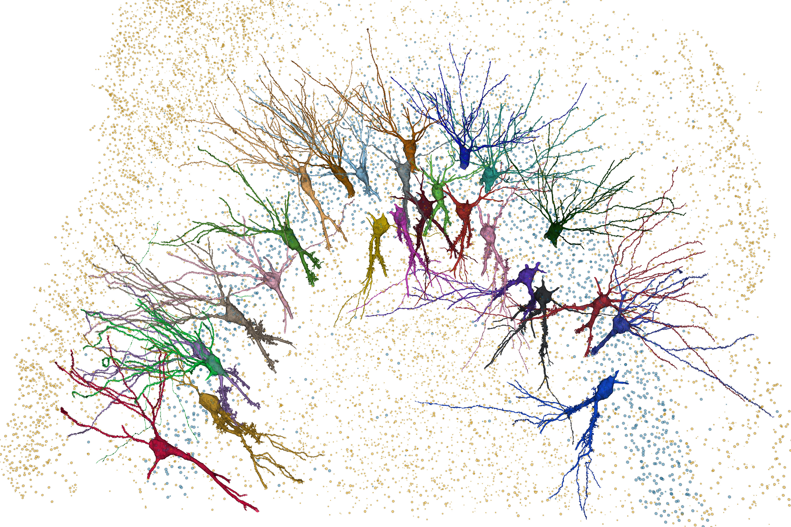

# Pyr.ai CA3 Visualization and Analysis Tools

This repository contains visualization, data-access, and analysis tools developed for working with the **Pyr.ai CA3 connectomics volume** of the mouse hippocampus.



## About This Repository

The project combines several approaches to exploring the Pyr.ai dataset, including:

* interactive 3D visualization of mesh segmentations in the volume
* Neuroglancer-based exploration of the Pyr volume
* programmatic access to Pyr.ai data through CAVE and related services
* synapse querying and connectivity analysis

## Pyr.ai and the CA3 Dataset

[Pyr.ai](https://pyr.ai/) provides access to a large-scale electron microscopy reconstruction of hippocampal area CA3, enabling detailed investigation of neuronal morphology, cellular ultrastructure, and connectivity at synaptic resolution.

Many of the tools in this repository use the Pyr CAVE infrastructure to query segmentation, annotations, synapses, and related data programmatically. Neuroglancer, VTK, Plotly, CloudVolume, and other Python-based tools provide complementary approaches to interactive visualization, local 3D rendering, geometry analysis, and exploration of structures such as mitochondria.

## Data Use and Permissions

Publicly released Pyr data are made available under the **Creative Commons Attribution-NonCommercial 4.0 International (CC BY-NC 4.0)** license and should be used with appropriate citation to the Pyr resource publication. Unpublished data and reconstructions remain subject to the [Pyr Terms of Service](https://pyr.ai/tos), [Pyr Principles](https://pyr.ai/principles), and applicable contributor permissions.

The Pyr dataset and associated reconstructions are produced and maintained by the Pyr project and its contributors. This repository contains independently developed visualization and analysis code and is not an official Pyr.ai repository.

## Acknowledgments

Special thanks to **Zhihao Zheng** for his assistance in providing access to the Pyr.ai CAVE volume and for his guidance and support in working with the dataset.

## License

The original code and notebooks in this repository are licensed under the [MIT License](LICENSE).

The Pyr.ai CA3 dataset, reconstructions, annotations, and other source data are not covered by this repository's MIT License. Publicly released Pyr data are provided under CC BY-NC 4.0 and remain subject to the applicable Pyr.ai terms, principles, attribution requirements, and contributor permissions.  

Example visualization images in this repository are also provided under CC BY-NC 4.0.

## Repository Structure

The repository is organized around Jupyter notebooks for individual visualization and analysis workflows, together with supporting helper modules and selected example outputs.

```text
pyr-volume/
├── img/
├── notebooks/
├── data/
└── README.md
```

Large source datasets, cached meshes, bulk synapse tables, and other generated outputs are generally not included in the repository.

## Reproducibility

The notebooks are designed around the public Pyr.ai infrastructure and associated Python tools. Depending on the workflow, they may require:

* access to the Pyr.ai CAVE services
* a valid CAVE authentication token
* access to Pyr segmentation and geometry resources
* Python packages used for CAVE, CloudVolume, Neuroglancer, VTK, Plotly, and scientific analysis
* internet access for querying remote Pyr resources

Individual notebooks contain additional setup information relevant to their particular workflow.

## Project Status

This repository is evolving alongside ongoing exploration of the Pyr.ai volume.

Public notebooks represent selected, cleaned versions of working analysis and visualization tools rather than a comprehensive software package.

## Links

* [Pyr.ai](https://pyr.ai/)
* [Pyr Terms of Service](https://pyr.ai/tos)
* [Pyr Principles](https://pyr.ai/principles)
* [Pyr Consortium](https://pyr.ai/consortium)
* [Pyr BioRxiv pre-print manuscript](https://www.biorxiv.org/content/10.1101/2025.07.09.663979v1)