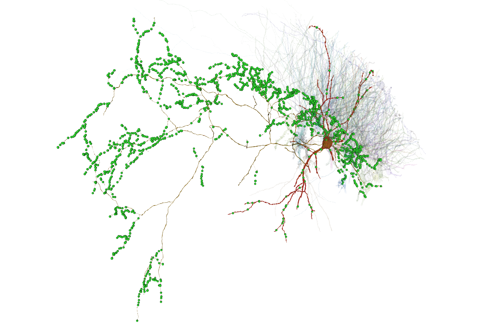
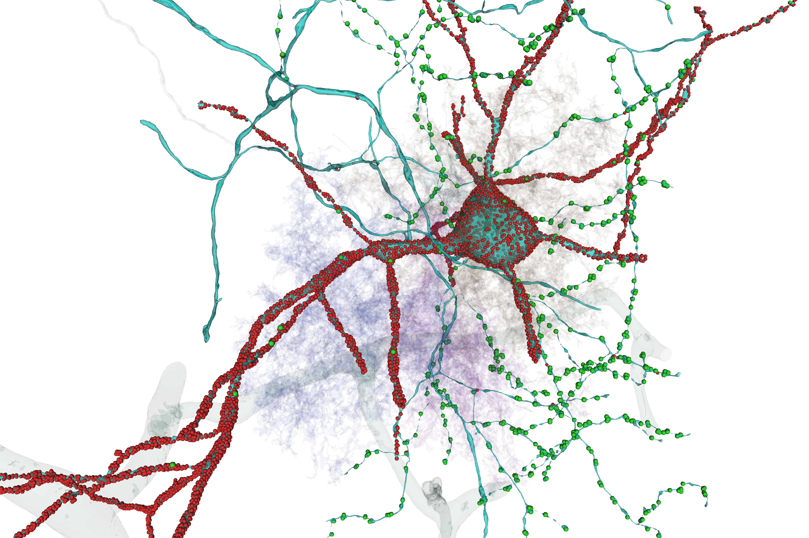
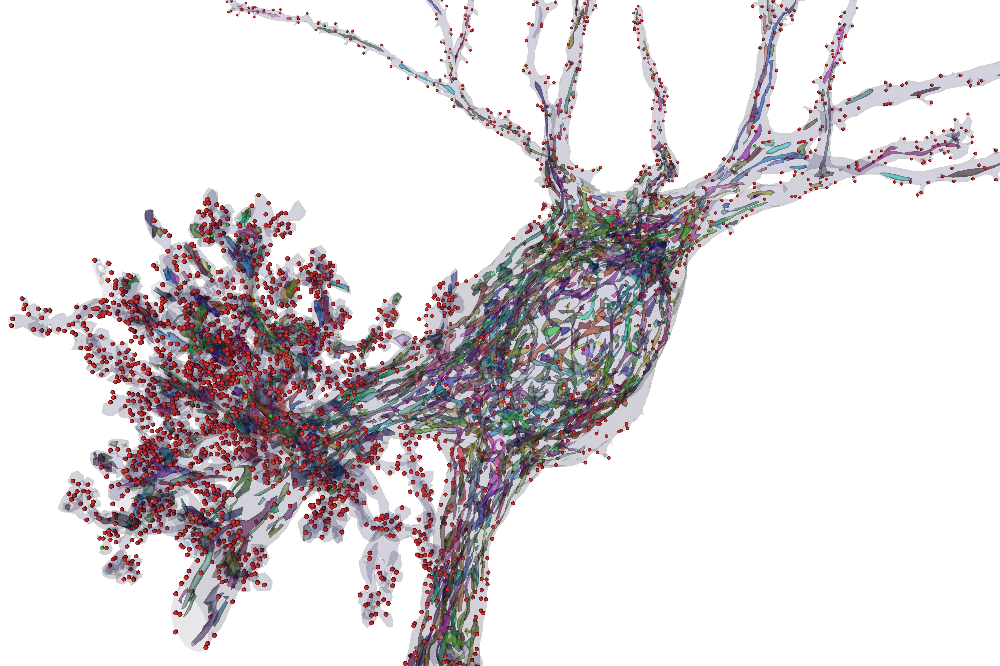
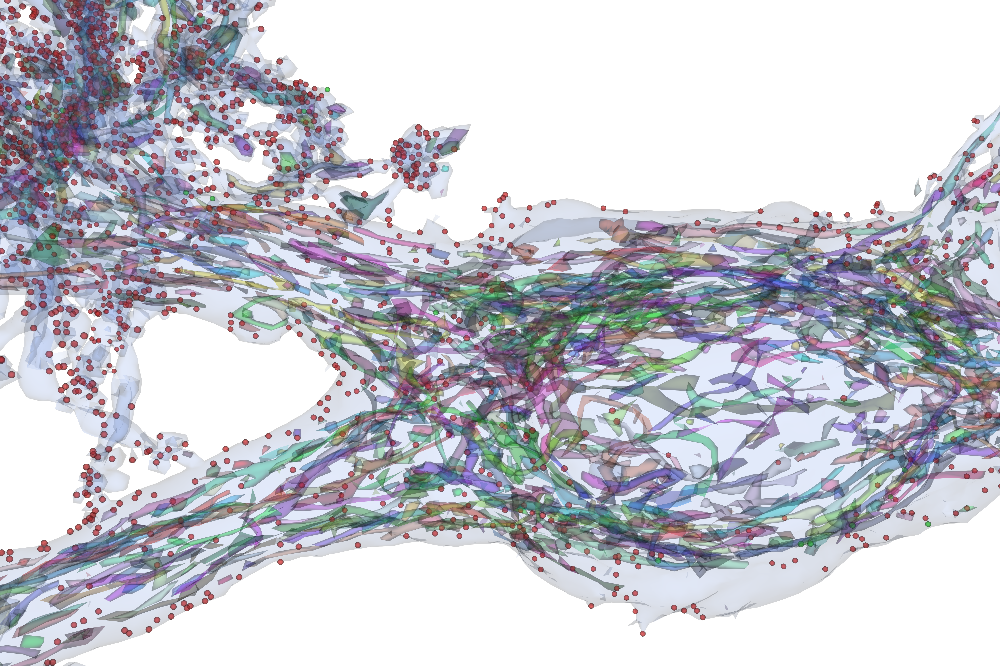

# Pyr.ai CA3 Notebooks

This directory contains Jupyter notebooks for accessing, downloading, visualizing, and analyzing data from the **Pyr.ai CA3 connectomics volume**. The notebooks are organized as individual tools rather than as a single required pipeline, although several share downloaded artifacts and helper functions.

The notebooks include example outputs so that their expected behavior and results can be inspected directly on GitHub.

## Notebooks

### [`00_pyr_cave_setup.ipynb`](00_pyr_cave_setup.ipynb)

CAVE setup and diagnostic notebook for the Pyr.ai `zheng_ca3` datastack.

It verifies authentication and connectivity, inspects datastack and volume metadata, reports available materialization versions and tables, and provides several example CAVE queries. This is a useful starting point for confirming that the local Python environment and CAVE access are working correctly.

---

### [`01_pyr_download_synapse_tables_by_list.ipynb`](01_pyr_download_synapse_tables_by_list.ipynb)

Batch downloader for afferent and efferent synapses associated with a user-supplied list of root IDs.

For each root, the notebook queries the Pyr.ai CAVE synapse table and stores the resulting data as a validated local artifact consisting of:

* a Parquet synapse table
* a matching metadata JSON file

Existing valid artifacts are reused rather than queried again. The notebook performs validation of cached data before reuse and summarizes the results of the batch at completion.

---

### [`01_pyr_neuroglancer_viewer.ipynb`](01_pyr_neuroglancer_viewer.ipynb)

Creates an interactive **Spelunker/Neuroglancer** view for a selected Pyr.ai root ID with its afferent and efferent synapses displayed as separate annotation sets.

The notebook is cache-first: if a valid local synapse artifact already exists, it is reused. If no local artifact exists, the notebook automatically queries CAVE, saves and validates the resulting synapse table, and then continues with viewer construction.

Existing partial or invalid local artifacts are not silently overwritten.

The final output includes a shortened Spelunker URL that can be opened in a web browser.

---

### [`02_pyr_mesh_download_and_decimation_by_list.ipynb`](02_pyr_mesh_download_and_decimation_by_list.ipynb)

Batch workflow for downloading segmentation meshes for a list of Pyr.ai root IDs and producing decimated copies suitable for interactive visualization.

The notebook:

* retrieves the full-resolution mesh
* validates downloaded mesh data
* saves the original mesh locally
* generates a decimated PLY mesh
* validates the decimated result
* reuses valid existing artifacts on later runs
* records batch results in a CSV summary

The full downloaded meshes are retained as local source artifacts, while the smaller decimated meshes are intended for downstream visualization workflows.

---

### [`03_pyr_vtk_decimated_cell_meshes_withsynapses.ipynb`](03_pyr_vtk_decimated_cell_meshes_withsynapses.ipynb)

Interactive **VTK 3D visualization** notebook for displaying decimated Pyr.ai cellular meshes, including neurons, astrocytes, vasculature, mitochondria, and synapse locations.

The notebook supports two principal visualization modes:

1. **Cellular mesh rendering** — displays selected reconstructed structures together in an interactive 3D scene.
2. **Mesh and synapse rendering** — adds afferent and efferent synapse locations for a selected neuron while allowing surrounding cellular structures to provide anatomical context.

Frequently adjusted settings such as mesh opacity, synapse marker size, synapse colors, and camera distance are exposed near the relevant render cells.

Image saving is intentionally separated from rendering. After a render is displayed, the camera can be interactively positioned before running the following save cell, allowing the final manually selected VTK view to be written to disk.

## VTK Visualization Examples

The following images are example views produced with the VTK visualization workflow.

<!-- Replace the filenames below with the curated images added to ../img/ -->

### Interneuron synapse visualization example



*Interneuron with afferent and efferent synapses visualization example.*

### Multiple cell-type visualization example



*Astrocyte, neuron, vasculature, and synapse visualization example.*

### Mitochondria and synapse visualization example



*Neuron with mitochondria and synapses visualization example.*



*Close-up view of the same neuron with mitochondria and synapses.*

## Typical Workflow

The notebooks can be used independently, but a common workflow is:

```text
00  Confirm CAVE access and inspect the Pyr.ai environment
 │
 ├── 01  Download and validate synapse tables
 │    └── 01  Visualize a neuron and its synapses in Neuroglancer
 │
 └── 02  Download and decimate cellular meshes
      └── 03  Render meshes and synapses interactively with VTK
```

Local artifacts generated by the download notebooks can be reused by later notebooks, avoiding unnecessary repeated queries or downloads.

## Helper Modules

Shared Python utilities are located in [`helpers/`](helpers/).

Current notebooks use helpers for functions such as:

* CAVE authentication
* relative/public-facing path display
* validated synapse-table caching and artifact management
* VTK render snapshot saving and associated metadata

The notebooks retain workflow-specific logic locally where keeping it visible makes the interactive analysis easier to understand and modify.

## Local Data and Generated Files

Several notebooks create local data products such as:

```text
data/
├── meshes/
│   └── dec/
└── synapse_tables/
```

These generated datasets can be large and are not intended to be part of the GitHub repository. Paths are resolved relative to the Pyr project directory so that the notebooks do not depend on a particular local drive or username.

## Notes

These notebooks were developed as practical visualization and analysis tools for the Pyr.ai CA3 volume. Some—particularly the VTK notebook—are intentionally interactive and may be most useful when run cell by cell rather than exclusively with **Run All**.

Dataset-specific settings such as the `zheng_ca3` datastack and materialization version used by these notebooks reflect the Pyr.ai dataset configuration for which the workflows were developed.
